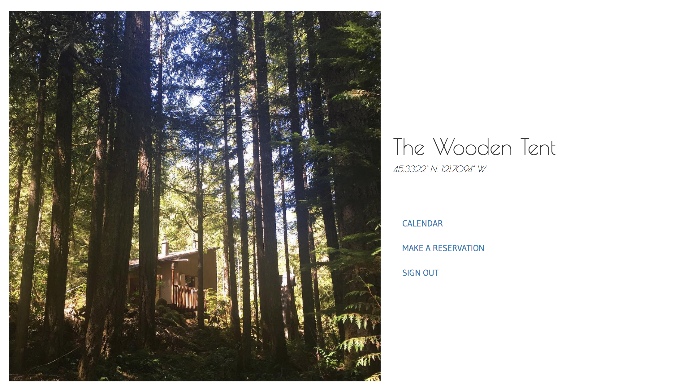

# Capstone Project: The Wooden Tent Scheduler

This minimalistic scheduler tool will allow my family to schedule visits to our cabin in Mt. Hood National Forest, so we can minimize the back and forth of scheduling via texts and calls and so there is one place to go to see the upcoming schedule. Despite the myriad of tools already available, we haven't been able to find one that sticks for everyone.

View the site here: https://bit.ly/2wHw4lT

<kbd></img></kbd>

### Main Features

* Calendar view
* Scheduler tool, including error handling for scheduling conflicts
* User profiles

### Design

* Minimalistic in the same vein as my portfolio website
* Black & white color scheme to allow cabin to pop

### To-Do

* Add ability to upload photos of the cabin
* Add messaging capabilities for people who run into a scheduling conflict to be able to send an email asking if they can switch days or adjust timelines.

### Technologies Used

* Ruby/Rails
* ActiveRecord  
* Devise
* Rails Admin
* Simple Calendar gem

### Installation

  1. _`$ git clone https://github.com/summersmaggie/capstone-project`_

  2. _`$ cd portfolio_website`_

  3. _`$ bundle install`_

  4. _`$ rake db:create`_

  5. _`$ rake db:migrate db:test:prepare`_

  6. _`$ rake db:seed`_

  7. _`$ rails server`_

#### Development server

Run `rails server` for a dev server. Navigate to `http://localhost:3000/`. The app will automatically reload if you change any of the source files.

### Known Bugs

  _No known bugs at this time._

### Support and contact details

  _To suggest changes, submit a pull request in the GitHub repository._

### License

  *MIT License*

Copyright (c) 2018 **Maggie Summers**
